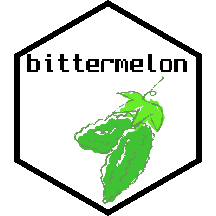
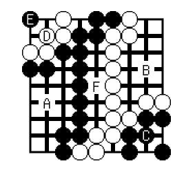
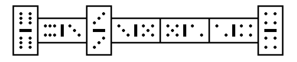

# bittermelon 

[](https://cran.r-project.org/package=bittermelon)
[](https://github.com/trevorld/bittermelon/actions)
[](https://codecov.io/github/trevorld/bittermelon?branch=main)

### Table of Contents

* [Overview](#overview)
* [Installation](#installation)
* [Examples](#examples)
* [Builtin Fonts](#fonts)
* [GNU Unifont via {hexfont}](#hexfont)
* [Game Bit](#gamebit)
* [Related Software](#similar)

**Please note this README is best [viewed elsewhere](https://trevorldavis.com/R/bittermelon/dev/) than `github.com`**. `github.com`'s default `line-height` setting causes distracting extraneous horizontal lines to appear when "printing" bitmaps and `github.com` [does not allow using CSS](https://gist.github.com/kivikakk/622b5dcf395e26c49e2334f0eb19e6f9) to set a more reasonable `line-height` value.

## <a name="overview">Overview</a>

`{bittermelon}` provides functions for creating and modifying bitmaps with special emphasis on bitmap fonts and their glyphs.  It provides native read/write support for the 'hex' and 'yaff' bitmap font formats and if 'Python' is installed can also read/write several more bitmap font formats using an embedded version of [monobit](https://github.com/robhagemans/monobit).  It features [over a dozen functions](https://trevorldavis.com/R/bittermelon/dev/reference/index.html#section-modify-bitmaps) that can modify individual bitmaps or every bitmap within a "bitmap list" or "bitmap font".  `{bittermelon}` can also pretty print bitmaps to the terminal and has a basic plot method.

## <a name="installation">Installation</a>


```r
remotes::install_github("trevorld/bittermelon")
```

The functions `read_monobit()` and `write_monobit()` that use the embedded version of [monobit](https://github.com/robhagemans/monobit) require that Python is available on the system.  A couple of the bitmap font output formats supported by `write_monobit()` also require that the "Pillow" or "reportlab" Python packages are installed (installable via `pip3`).

## <a name="examples">Examples</a>


```r
library("bittermelon") # remotes::install_github("trevorld/bittermelon")
```

```

Attaching package: 'bittermelon'
```

```
The following object is masked from 'package:base':

    which
```

```r
font_file <- system.file("fonts/spleen/spleen-8x16.hex.gz", package = "bittermelon")
font <- read_hex(font_file)
bml <- as_bm_list("RSTATS", font = font)
# With vertical compression
bm <- bml |> bm_call(cbind) |> bm_compress("vertical")
print(bm)
```

```{.bitmap}
                                                
██▀▀▀█▄ ▄█▀▀▀▀▀ ▀▀▀██▀▀▀▄█▀▀▀█▄ ▀▀▀██▀▀▀▄█▀▀▀▀▀ 
██   ██ ██         ██   ██   ██    ██   ██      
██▀▀▀█▄  ▀▀▀▀█▄    ██   ██▀▀▀██    ██    ▀▀▀▀█▄ 
██   ██      ██    ██   ██   ██    ██        ██ 
██   ██ ▄▄▄▄▄█▀    ██   ██   ██    ██   ▄▄▄▄▄█▀ 
                                                
                                                
```

```r
# Upside down with ASCII characters
bm <- bml |> 
    bm_flip("both") |> 
    bm_call(cbind, direction = "RTL")
print(bm, px = px_ascii)
```

```{.bitmap}
------------------------------------------------
------------------------------------------------
------------------------------------------------
------------------------------------------------
--@@@@@@---@@----@@---@@---@@-----@@@@@@-@@---@@
-@@--------@@----@@---@@---@@----@@------@@---@@
-@@--------@@----@@---@@---@@----@@------@@---@@
-@@--------@@----@@---@@---@@----@@------@@---@@
-@@--------@@----@@---@@---@@----@@------@@---@@
--@@@@@----@@----@@@@@@@---@@-----@@@@@---@@@@@@
------@@---@@----@@---@@---@@---------@@-@@---@@
------@@---@@----@@---@@---@@---------@@-@@---@@
------@@---@@----@@---@@---@@---------@@-@@---@@
-@@@@@@-@@@@@@@@--@@@@@-@@@@@@@@-@@@@@@---@@@@@@
------------------------------------------------
------------------------------------------------
```

```r
# With a shadow effect and borders
bm <- bml |> 
    bm_pad(sides = 2L) |>
    bm_shadow() |>
    bm_extend(sides = c(2L, 1L), value = 3L) |>
    bm_call(cbind) |> 
    bm_pad(sides = 2L, value = 3L)
print(bm)
```

```{.bitmap}
▓▓▓▓▓▓▓▓▓▓▓▓▓▓▓▓▓▓▓▓▓▓▓▓▓▓▓▓▓▓▓▓▓▓▓▓▓▓▓▓▓▓▓▓▓▓▓▓▓▓▓▓▓▓▓▓▓▓▓▓▓▓▓▓▓▓▓▓▓▓▓▓▓▓▓▓▓▓▓▓▓▓▓▓▓▓▓▓
▓▓▓▓▓▓▓▓▓▓▓▓▓▓▓▓▓▓▓▓▓▓▓▓▓▓▓▓▓▓▓▓▓▓▓▓▓▓▓▓▓▓▓▓▓▓▓▓▓▓▓▓▓▓▓▓▓▓▓▓▓▓▓▓▓▓▓▓▓▓▓▓▓▓▓▓▓▓▓▓▓▓▓▓▓▓▓▓
▓▓░░░░░░░░░░░░▓▓░░░░░░░░░░░░▓▓░░░░░░░░░░░░░▓▓░░░░░░░░░░░░▓▓░░░░░░░░░░░░░▓▓░░░░░░░░░░░░▓▓
▓▓░░░░░░░░░░░░▓▓░░░░░░░░░░░░▓▓░░░░░░░░░░░░░▓▓░░░░░░░░░░░░▓▓░░░░░░░░░░░░░▓▓░░░░░░░░░░░░▓▓
▓▓░░██████░░░░▓▓░░░██████░░░▓▓░░████████░░░▓▓░░░█████░░░░▓▓░░████████░░░▓▓░░░██████░░░▓▓
▓▓░░██▒▒▒██░░░▓▓░░██▒▒▒▒▒▒░░▓▓░░░▒▒██▒▒▒▒░░▓▓░░██▒▒▒██░░░▓▓░░░▒▒██▒▒▒▒░░▓▓░░██▒▒▒▒▒▒░░▓▓
▓▓░░██▒░░██▒░░▓▓░░██▒░░░░░░░▓▓░░░░░██▒░░░░░▓▓░░██▒░░██▒░░▓▓░░░░░██▒░░░░░▓▓░░██▒░░░░░░░▓▓
▓▓░░██▒░░██▒░░▓▓░░██▒░░░░░░░▓▓░░░░░██▒░░░░░▓▓░░██▒░░██▒░░▓▓░░░░░██▒░░░░░▓▓░░██▒░░░░░░░▓▓
▓▓░░██████▒▒░░▓▓░░░█████░░░░▓▓░░░░░██▒░░░░░▓▓░░███████▒░░▓▓░░░░░██▒░░░░░▓▓░░░█████░░░░▓▓
▓▓░░██▒▒▒██░░░▓▓░░░░▒▒▒██░░░▓▓░░░░░██▒░░░░░▓▓░░██▒▒▒██▒░░▓▓░░░░░██▒░░░░░▓▓░░░░▒▒▒██░░░▓▓
▓▓░░██▒░░██▒░░▓▓░░░░░░░██▒░░▓▓░░░░░██▒░░░░░▓▓░░██▒░░██▒░░▓▓░░░░░██▒░░░░░▓▓░░░░░░░██▒░░▓▓
▓▓░░██▒░░██▒░░▓▓░░░░░░░██▒░░▓▓░░░░░██▒░░░░░▓▓░░██▒░░██▒░░▓▓░░░░░██▒░░░░░▓▓░░░░░░░██▒░░▓▓
▓▓░░██▒░░██▒░░▓▓░░░░░░░██▒░░▓▓░░░░░██▒░░░░░▓▓░░██▒░░██▒░░▓▓░░░░░██▒░░░░░▓▓░░░░░░░██▒░░▓▓
▓▓░░██▒░░██▒░░▓▓░░██████▒▒░░▓▓░░░░░██▒░░░░░▓▓░░██▒░░██▒░░▓▓░░░░░██▒░░░░░▓▓░░██████▒▒░░▓▓
▓▓░░░▒▒░░░▒▒░░▓▓░░░▒▒▒▒▒▒░░░▓▓░░░░░░▒▒░░░░░▓▓░░░▒▒░░░▒▒░░▓▓░░░░░░▒▒░░░░░▓▓░░░▒▒▒▒▒▒░░░▓▓
▓▓░░░░░░░░░░░░▓▓░░░░░░░░░░░░▓▓░░░░░░░░░░░░░▓▓░░░░░░░░░░░░▓▓░░░░░░░░░░░░░▓▓░░░░░░░░░░░░▓▓
▓▓░░░░░░░░░░░░▓▓░░░░░░░░░░░░▓▓░░░░░░░░░░░░░▓▓░░░░░░░░░░░░▓▓░░░░░░░░░░░░░▓▓░░░░░░░░░░░░▓▓
▓▓▓▓▓▓▓▓▓▓▓▓▓▓▓▓▓▓▓▓▓▓▓▓▓▓▓▓▓▓▓▓▓▓▓▓▓▓▓▓▓▓▓▓▓▓▓▓▓▓▓▓▓▓▓▓▓▓▓▓▓▓▓▓▓▓▓▓▓▓▓▓▓▓▓▓▓▓▓▓▓▓▓▓▓▓▓▓
▓▓▓▓▓▓▓▓▓▓▓▓▓▓▓▓▓▓▓▓▓▓▓▓▓▓▓▓▓▓▓▓▓▓▓▓▓▓▓▓▓▓▓▓▓▓▓▓▓▓▓▓▓▓▓▓▓▓▓▓▓▓▓▓▓▓▓▓▓▓▓▓▓▓▓▓▓▓▓▓▓▓▓▓▓▓▓▓
```

```r
# Can also print colored terminal output via suggested package {crayon}
if (crayon::has_color())
    print(bm, px = " ", bg = c("white", "black", "grey", "red"))
```

```r
plot(bm, col = c("white", "darkblue", "lightblue", "black"))
```


## <a name="fonts">Builtin Fonts</a>

`{bittermelon}` has a builtin versions of the 8x16 [Spleen](https://github.com/fcambus/spleen) font as well as 4x6 and 6x13 [Fixed](https://www.cl.cam.ac.uk/~mgk25/ucs-fonts.html) fonts.


```r
spleen_8x16 <- read_hex(system.file("fonts/spleen/spleen-8x16.hex.gz",
                                    package = "bittermelon"))
fixed_4x6 <- read_yaff(system.file("fonts/fixed/4x6.yaff.gz", 
                                   package = "bittermelon"))
fixed_6x13 <- read_yaff(system.file("fonts/fixed/6x13.yaff.gz", 
                                    package = "bittermelon"))
as_bm_bitmap("RSTATS", font = spleen_8x16) |> bm_compress("v")
```

```{.bitmap}
                                                
██▀▀▀█▄ ▄█▀▀▀▀▀ ▀▀▀██▀▀▀▄█▀▀▀█▄ ▀▀▀██▀▀▀▄█▀▀▀▀▀ 
██   ██ ██         ██   ██   ██    ██   ██      
██▀▀▀█▄  ▀▀▀▀█▄    ██   ██▀▀▀██    ██    ▀▀▀▀█▄ 
██   ██      ██    ██   ██   ██    ██        ██ 
██   ██ ▄▄▄▄▄█▀    ██   ██   ██    ██   ▄▄▄▄▄█▀ 
                                                
                                                
```

```r
as_bm_bitmap("RSTATS", font = fixed_4x6) |> bm_compress("v")
```

```{.bitmap}
█▀▄ ▄▀▀ ▀█▀ ▄▀▄ ▀█▀ ▄▀▀ 
█▀▄  ▀▄  █  █▀█  █   ▀▄ 
▀ ▀ ▀▀   ▀  ▀ ▀  ▀  ▀▀  
```

```r
as_bm_bitmap("RSTATS", font = fixed_6x13) |> bm_compress("v")
```

```{.bitmap}
                                    
█▀▀▀▄ ▄▀▀▀▄ ▀▀█▀▀  ▄▀▄  ▀▀█▀▀ ▄▀▀▀▄ 
█   █ █       █   █   █   █   █     
█▀█▀   ▀▀▀▄   █   █▄▄▄█   █    ▀▀▀▄ 
█  ▀▄ ▄   █   █   █   █   █   ▄   █ 
▀   ▀  ▀▀▀    ▀   ▀   ▀   ▀    ▀▀▀  
                                    
```

## <a name="hexfont">GNU Unifont via {hexfont}</a>

The [{hexfont}](https://github.com/trevorld/hexfont) package includes a helper function `unifont()` which loads several GNU Unifont hex fonts as a single `{bittermelon}` `bm_font()` object.  [GNU Unifont](https://unifoundry.com/unifont/index.html) is a monoscale bitmap font (8x16 and 16x16 glyphs) that pretty much covers all of the official Unicode glyphs plus several of the artificial scripts in the [(Under-)ConScript Unicode Registry](https://www.kreativekorp.com/ucsur/).


```r
library("hexfont") # remotes::install_github("trevorld/hexfont")
system.time(font <- unifont()) # Unifont is a **big** font
```

```{.bitmap}
   user  system elapsed 
 55.912   0.056  55.970 
```

```r
length(font) |> prettyNum(big.mark = ",") # number of glyphs
```

```{.bitmap}
[1] "77,418"
```

```r
object.size(font) |> format(units = "MB") # memory used
```

```{.bitmap}
[1] "116 Mb"
```

```r
# Mandarin Chinese
as_bm_bitmap("Ｒ很棒！", font = font) |> bm_compress("v")
```

```{.bitmap}
                    █ ▄▄▄▄▄▄▄      █      █                     
                  ▄▀  █     █      █  ▀▀▀▀█▀▀▀▀                 
  ██▀▀▀▀▀▀▀▀▄▄   ▀  █ █▀▀▀▀▀█   ▀▀▀█▀▀ ▀▀█▀▀▀▀         ██       
  ██        ██    ▄█  █▄▄▄▄▄█     ██▄ ▀▀█▀▀▀█▀▀        ██       
  ██▀▀▀▀██▀▀    ▄▀ █  █  █  ▄▀   █ █ ▀▄▀  █  ▀▄        ██       
  ██      ██       █  █   █▀    ▀  █    ▀▀█▀▀          ▀▀       
  ██        ██     █  █ ▄  ▀▄      █  ▀▀▀▀█▀▀▀▀        ██       
                   █  █▀     ▀▀    █      █                     
```

```r
# Emoji
as_bm_bitmap("🐭🐲🐵", font = font) |> bm_compress("v")
```

```{.bitmap}
  ▄▄       ▄▄           ▄▄▄            ▄▄       
▄▀  ▀▄▄▄▄▄▀  ▀▄       ▄█▀           ▄█▀██▀█▄    
█    ▀   ▀    █      ▄████       ▄▀█ ▄▄  ▄▄ █▀▄ 
▄█   ▀   ▀   █▄   ▄▄██▄█████     ▀▄█ ▀▀  ▀▀ █▄▀ 
▄█▀    ▄    ▀█▄ ▄█▄███████████     ▄▀      ▀▄   
  ▀▄  ▀▀▀  ▄▀   ▀▀▀▀▀███▀▀█████    █ ▀▄▄▄▄▀ █   
    ▀▀▄▄▄▀▀        ▄███   ████▀     ▀▀▄▄▄▄▀▀    
                  ▀▀▀     ▀▀▀                   
```

## <a name="gamebit">Game Bit</a>

I wrote `{bittermelon}` in order to help create [Game Bit](https://github.com/trevorld/game-bit-font), a fixed-width [bitmap](https://en.wikipedia.org/wiki/Computer_font#BITMAP) font specialized for making board game diagrams. The [duospaced](https://en.wikipedia.org/wiki/Duospaced_font) version is called **Game Bit Duo** while the square [monospaced](https://en.wikipedia.org/wiki/Monospaced_font) version is called **Game Bit Mono**.  Check out the [Game Bit Github repo](https://github.com/trevorld/game-bit-font) to see an extended example of using `{bittermelon}` to make a custom font (albeit with several glyphs adopted/adapted from [GNU Unifont](https://unifoundry.com/unifont/index.html)).

 

## <a name="similar">Related Software</a>

### R packages

* [bdftools](https://github.com/coolbutuseless/bdftools) provides some tools for reading and manipulating BDF bitmap fonts.  In particular provides much richer graphical output capabilities than `{bittermelon}` will likely support including a specialized `{ggplot2}` geom. 
* [fontr](https://github.com/yixuan/fontr) allows one to extract character glyphs from a specific font (which itself may not be a bitmap font) as a bitmap.
* [raster](https://rspatial.org/raster/pkg/index.html) has tools for manipulating "raster" objects with a focus on spatial applications.

### Python

* [BDF Parser Python library](https://github.com/tomchen/bdfparser)
* [bdflib](https://gitlab.com/Screwtapello/bdflib)
* [monobit](https://github.com/robhagemans/monobit) lets one modify bitmap fonts and convert between several formats.  Embedded within `{bittermelon}`.

### Other

* [Bits'n'Picas](https://github.com/kreativekorp/bitsnpicas)
* [FontForge](https://fontforge.org/en-US/)

### Fonts

* [Fixed](https://www.cl.cam.ac.uk/~mgk25/ucs-fonts.html) aka "Unicode fonts and tools for X11"
* Embedded in `{hexfont}` package:

  * [GNU Unifont](https://www.unifoundry.com/unifont/index.html)

* [Hoard of Bitfonts](https://github.com/robhagemans/hoard-of-bitfonts)
* [bitmap-fonts](https://github.com/Tecate/bitmap-fonts)
* Embedded in `{bdftools}` package:

  * [Cozette](https://github.com/slavfox/Cozette)
  * [Creep2](https://github.com/raymond-w-ko/creep2) 
  * [Spleen](https://github.com/fcambus/spleen)
