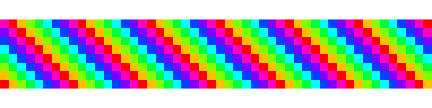
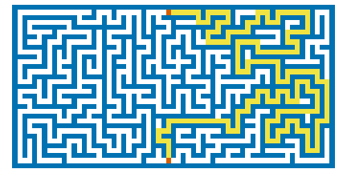

# bittermelon 

[](https://cran.r-project.org/package=bittermelon)
[](https://github.com/trevorld/bittermelon/actions)
[](https://app.codecov.io/github/trevorld/bittermelon?branch=main)

### Table of Contents

* [Overview](#overview)
* [Installation](#installation)
* [Examples](#examples)

  - [Bitmap font glyphs](#ex-glyphs)
  - [{gridpattern} matrices](#ex-gridpattern)
  - [{mazing} mazes](#ex-mazes)
  - [Sprites](#ex-sprites)

* [Builtin Fonts](#fonts)
* [GNU Unifont via {hexfont}](#hexfont)
* [Game Bit](#gamebit)
* [Related Software](#similar)

**Please note this README is best [viewed elsewhere](https://trevorldavis.com/R/bittermelon/dev/) than `github.com`**. `github.com`'s default `line-height` setting causes distracting extraneous horizontal lines to appear when "printing" bitmaps and `github.com` [does not allow using CSS](https://gist.github.com/kivikakk/622b5dcf395e26c49e2334f0eb19e6f9) to set a more reasonable `line-height` value.

## <a name="overview">Overview</a>

* `{bittermelon}` features [over a dozen functions](https://trevorldavis.com/R/bittermelon/dev/reference/index.html#modify-bitmaps-and-pixmaps) that can modify individual bitmaps or every bitmap within a "bitmap list" or "bitmap font".
* There is a special emphasis on bitmap fonts and their glyphs.  It provides native read/write support for the 'hex' and 'yaff' bitmap font formats and if [monobit](https://github.com/robhagemans/monobit) is also installed then it can read/write [several more bitmap font formats](https://github.com/robhagemans/monobit?tab=readme-ov-file#supported-bitmap-formats).
* It can print bitmaps to the R terminal.
* Besides supporting the builtin `bm_bitmap()` and `bm_pixmap()` objects it also supports modifying `{magick}`'s "magick-image" objects and base R's "nativeRaster" and "raster" objects.

## <a name="installation">Installation</a>


``` r
remotes::install_github("trevorld/bittermelon")
```

* The functions `read_monobit()` and `write_monobit()` require that [monobit](https://github.com/robhagemans/monobit) is installed (i.e. `pip3 install monobit`).
* The function `bm_distort()` requires the suggested package [magick](https://github.com/ropensci/magick).
* Support for "nativeRaster" objects requires the suggested package [farver](https://github.com/thomasp85/farver).

## <a name="examples">Examples</a>


### <a name="ex-glyphs">Bitmap font glyphs</a>


``` r
library("bittermelon") # remotes::install_github("trevorld/bittermelon")
font_file <- system.file("fonts/spleen/spleen-8x16.hex.gz", package = "bittermelon")
font <- read_hex(font_file)
bml <- as_bm_list("RSTATS", font = font)
# With vertical compression
bm <- bml |> bm_call(cbind) |> bm_compress("vertical")
print(bm)
```

``` bitmap
                                                
██▀▀▀█▄ ▄█▀▀▀▀▀ ▀▀▀██▀▀▀▄█▀▀▀█▄ ▀▀▀██▀▀▀▄█▀▀▀▀▀ 
██   ██ ██         ██   ██   ██    ██   ██      
██▀▀▀█▄  ▀▀▀▀█▄    ██   ██▀▀▀██    ██    ▀▀▀▀█▄ 
██   ██      ██    ██   ██   ██    ██        ██ 
██   ██ ▄▄▄▄▄█▀    ██   ██   ██    ██   ▄▄▄▄▄█▀ 
                                                
                                                
```

``` r
# Upside down with ASCII characters
bm <- bml |>
    bm_flip("both") |>
    bm_call(cbind, direction = "RTL")
print(bm, px = px_ascii)
```

``` bitmap
------------------------------------------------
------------------------------------------------
------------------------------------------------
------------------------------------------------
--@@@@@@---@@----@@---@@---@@-----@@@@@@-@@---@@
-@@--------@@----@@---@@---@@----@@------@@---@@
-@@--------@@----@@---@@---@@----@@------@@---@@
-@@--------@@----@@---@@---@@----@@------@@---@@
-@@--------@@----@@---@@---@@----@@------@@---@@
--@@@@@----@@----@@@@@@@---@@-----@@@@@---@@@@@@
------@@---@@----@@---@@---@@---------@@-@@---@@
------@@---@@----@@---@@---@@---------@@-@@---@@
------@@---@@----@@---@@---@@---------@@-@@---@@
-@@@@@@-@@@@@@@@--@@@@@-@@@@@@@@-@@@@@@---@@@@@@
------------------------------------------------
------------------------------------------------
```

``` r
# With a shadow effect and borders
bm <- bml |>
    bm_pad(sides = 2L) |>
    bm_shadow() |>
    bm_extend(sides = c(2L, 1L), value = 3L) |>
    bm_call(cbind) |>
    bm_pad(sides = 2L, value = 3L)
print(bm)
```

``` bitmap
▓▓▓▓▓▓▓▓▓▓▓▓▓▓▓▓▓▓▓▓▓▓▓▓▓▓▓▓▓▓▓▓▓▓▓▓▓▓▓▓▓▓▓▓▓▓▓▓▓▓▓▓▓▓▓▓▓▓▓▓▓▓▓▓▓▓▓▓▓▓▓▓▓▓▓▓▓▓▓▓▓▓▓▓▓▓▓▓
▓▓▓▓▓▓▓▓▓▓▓▓▓▓▓▓▓▓▓▓▓▓▓▓▓▓▓▓▓▓▓▓▓▓▓▓▓▓▓▓▓▓▓▓▓▓▓▓▓▓▓▓▓▓▓▓▓▓▓▓▓▓▓▓▓▓▓▓▓▓▓▓▓▓▓▓▓▓▓▓▓▓▓▓▓▓▓▓
▓▓░░░░░░░░░░░░▓▓░░░░░░░░░░░░▓▓░░░░░░░░░░░░░▓▓░░░░░░░░░░░░▓▓░░░░░░░░░░░░░▓▓░░░░░░░░░░░░▓▓
▓▓░░░░░░░░░░░░▓▓░░░░░░░░░░░░▓▓░░░░░░░░░░░░░▓▓░░░░░░░░░░░░▓▓░░░░░░░░░░░░░▓▓░░░░░░░░░░░░▓▓
▓▓░░██████░░░░▓▓░░░██████░░░▓▓░░████████░░░▓▓░░░█████░░░░▓▓░░████████░░░▓▓░░░██████░░░▓▓
▓▓░░██▒▒▒██░░░▓▓░░██▒▒▒▒▒▒░░▓▓░░░▒▒██▒▒▒▒░░▓▓░░██▒▒▒██░░░▓▓░░░▒▒██▒▒▒▒░░▓▓░░██▒▒▒▒▒▒░░▓▓
▓▓░░██▒░░██▒░░▓▓░░██▒░░░░░░░▓▓░░░░░██▒░░░░░▓▓░░██▒░░██▒░░▓▓░░░░░██▒░░░░░▓▓░░██▒░░░░░░░▓▓
▓▓░░██▒░░██▒░░▓▓░░██▒░░░░░░░▓▓░░░░░██▒░░░░░▓▓░░██▒░░██▒░░▓▓░░░░░██▒░░░░░▓▓░░██▒░░░░░░░▓▓
▓▓░░██████▒▒░░▓▓░░░█████░░░░▓▓░░░░░██▒░░░░░▓▓░░███████▒░░▓▓░░░░░██▒░░░░░▓▓░░░█████░░░░▓▓
▓▓░░██▒▒▒██░░░▓▓░░░░▒▒▒██░░░▓▓░░░░░██▒░░░░░▓▓░░██▒▒▒██▒░░▓▓░░░░░██▒░░░░░▓▓░░░░▒▒▒██░░░▓▓
▓▓░░██▒░░██▒░░▓▓░░░░░░░██▒░░▓▓░░░░░██▒░░░░░▓▓░░██▒░░██▒░░▓▓░░░░░██▒░░░░░▓▓░░░░░░░██▒░░▓▓
▓▓░░██▒░░██▒░░▓▓░░░░░░░██▒░░▓▓░░░░░██▒░░░░░▓▓░░██▒░░██▒░░▓▓░░░░░██▒░░░░░▓▓░░░░░░░██▒░░▓▓
▓▓░░██▒░░██▒░░▓▓░░░░░░░██▒░░▓▓░░░░░██▒░░░░░▓▓░░██▒░░██▒░░▓▓░░░░░██▒░░░░░▓▓░░░░░░░██▒░░▓▓
▓▓░░██▒░░██▒░░▓▓░░██████▒▒░░▓▓░░░░░██▒░░░░░▓▓░░██▒░░██▒░░▓▓░░░░░██▒░░░░░▓▓░░██████▒▒░░▓▓
▓▓░░░▒▒░░░▒▒░░▓▓░░░▒▒▒▒▒▒░░░▓▓░░░░░░▒▒░░░░░▓▓░░░▒▒░░░▒▒░░▓▓░░░░░░▒▒░░░░░▓▓░░░▒▒▒▒▒▒░░░▓▓
▓▓░░░░░░░░░░░░▓▓░░░░░░░░░░░░▓▓░░░░░░░░░░░░░▓▓░░░░░░░░░░░░▓▓░░░░░░░░░░░░░▓▓░░░░░░░░░░░░▓▓
▓▓░░░░░░░░░░░░▓▓░░░░░░░░░░░░▓▓░░░░░░░░░░░░░▓▓░░░░░░░░░░░░▓▓░░░░░░░░░░░░░▓▓░░░░░░░░░░░░▓▓
▓▓▓▓▓▓▓▓▓▓▓▓▓▓▓▓▓▓▓▓▓▓▓▓▓▓▓▓▓▓▓▓▓▓▓▓▓▓▓▓▓▓▓▓▓▓▓▓▓▓▓▓▓▓▓▓▓▓▓▓▓▓▓▓▓▓▓▓▓▓▓▓▓▓▓▓▓▓▓▓▓▓▓▓▓▓▓▓
▓▓▓▓▓▓▓▓▓▓▓▓▓▓▓▓▓▓▓▓▓▓▓▓▓▓▓▓▓▓▓▓▓▓▓▓▓▓▓▓▓▓▓▓▓▓▓▓▓▓▓▓▓▓▓▓▓▓▓▓▓▓▓▓▓▓▓▓▓▓▓▓▓▓▓▓▓▓▓▓▓▓▓▓▓▓▓▓
```

We can also print colored terminal output with help of `{cli}`:


``` r
if (cli::num_ansi_colors() >= 16L)
    print(bm, px = " ",
          bg = c(cli::bg_br_white, cli::bg_blue, cli::bg_cyan, cli::bg_red))
```

``` r
plot(bm, col = c("white", "blue3", "cyan3", "red3"))
```


### <a name="ex-gridpattern">{gridpattern} matrices</a>


``` r
# Also supports {gridpattern} matrices
gridpattern::pattern_weave("twill_herringbone", nrow=14L, ncol = 50L) |>
    as_bm_bitmap() |>
    print(compress = "vertical")
```

``` bitmap
 █▄ ▀█  █▄ ▀█  █▄ ▀█  █▄ ▀█  █▄ ▀█  █▄ ▀█  █▄ ▀█  
  █▄ ▀█  █▄ ▀█  █▄ ▀█  █▄ ▀█  █▄ ▀█  █▄ ▀█  █▄ ▀█ 
█  █▄ ▀█  █▄ ▀█  █▄ ▀█  █▄ ▀█  █▄ ▀█  █▄ ▀█  █▄ ▀█
▀▀▄▄▀▄▄▀▀▄▄▀▄▄▀▀▄▄▀▄▄▀▀▄▄▀▄▄▀▀▄▄▀▄▄▀▀▄▄▀▄▄▀▀▄▄▀▄▄▀
 ██ ▄█▀ ██ ▄█▀ ██ ▄█▀ ██ ▄█▀ ██ ▄█▀ ██ ▄█▀ ██ ▄█▀ 
██ ▄█▀ ██ ▄█▀ ██ ▄█▀ ██ ▄█▀ ██ ▄█▀ ██ ▄█▀ ██ ▄█▀ █
█ ▄█▀ ██ ▄█▀ ██ ▄█▀ ██ ▄█▀ ██ ▄█▀ ██ ▄█▀ ██ ▄█▀ ██
```


``` r
gridpattern::pattern_square(subtype=8L, nrow=8L, ncol = 50L) |>
    as_bm_pixmap(s, col = grDevices::rainbow(8L)) |>
    plot()
```



### <a name="ex-mazes">{mazing} mazes</a>


``` r
# Also supports {mazing} mazes
set.seed(42)
m <- mazing::maze(16L, 32L)
m |> as_bm_bitmap(walls = TRUE) |>
    print(compress = "vertical")
```

``` bitmap
█▀▀▀▀▀▀▀▀▀▀▀▀▀▀▀█▀▀▀█▀▀▀▀▀█▀▀▀▀▀▀▀▀▀▀▀█▀▀▀▀▀█▀▀▀▀▀▀▀█▀▀▀▀▀▀▀█▀▀▀█ 
█ █▀▀▀▀▀▀▀▀▀█ ▀▀▀ █ ▀ █ █ █ █ ▀▀█▀▀▀▀ ▀ █▀▀ █ █▀▀ █ ▀ █▀▀▀█ █ █ █ 
█ █ ▀▀▀▀█▀▀ ▀▀▀▀█▀█▀▀▀▀ █ █ █▀▀ █▀▀▀█▀█▀▀ █▀▀▀▀ █▀▀▀▀▀█ ▀▀▀ █ █ █ 
█ █▀▀ █▀▀ █▀▀▀▀ █ █ ▀▀█▀█ ▀▀█ █▀▀ █ █ ▀ ▀▀▀ █▀▀▀▀▀▀▀▀ █ ▀▀█▀▀▀▀ █ 
█ ▀▀▀▀█ █▀█ █▀▀▀▀ █▀▀ █ █▀▀ █ █ █▀█ ▀▀█▀▀▀▀▀█ █▀█ ▀▀▀▀▀▀▀ █ █ ▀▀█ 
█▀▀▀▀ █ █ ▀ █ █▀█ █ █▀▀ █ █▀▀ █ ▀ ▀▀█ █ █ ▀▀█ █ ▀▀▀▀▀▀█▀▀▀▀ ▀▀█ █ 
█ █▀▀▀▀ █ ▀▀█ █ ▀ █ █▀▀ █ █ █ ▀▀▀ █▀▀ █ █▀▀ █ ▀ █▀▀▀█ █▀▀▀▀▀▀▀█ █ 
█ ▀ █▀█▀▀▀▀ █ ▀▀▀▀█ █ █ █ ▀▀▀▀█ ▀▀█ ▀▀▀▀█ ▀▀▀▀▀▀▀ █ █ ▀ █▀▀▀█ ▀ █ 
█▀▀▀▀ █ █▀▀▀▀ ▀▀█ █ █ ▀▀▀▀▀▀█ █ █▀▀▀█▀▀ █ █▀▀▀▀ █▀▀▀█▀▀▀█ █ ▀▀█ █ 
█ ▀▀█ ▀ █ ▀▀█▀▀▀▀ █ ▀▀█ █ ▀▀▀ █ █ █ █ ▀▀█ █ █ █▀▀ █ ▀ █ ▀ ▀▀█ █ █ 
█▀▀ ▀▀▀▀▀▀█▀▀ █▀▀ █▀▀ █ █▀▀▀█ ▀▀▀ █ ▀▀▀ █▀▀ █▀▀ █▀▀▀█▀▀▀▀▀▀▀▀ █ █ 
█ █▀▀▀▀▀█ ▀ █▀▀ ▀▀█ ▀▀▀▀▀ █ █▀█▀▀▀▀▀▀▀▀▀▀ ▀▀█ █▀▀ █▀▀ █▀▀▀█ █▀▀ █ 
█ █ ▀▀█ █▀▀▀▀▀▀▀█ █▀▀▀▀▀█▀█ █ ▀ █▀▀▀█▀▀▀▀▀█ ▀ █▀▀ █ █▀▀ █ ▀▀█ █▀█ 
█ █▀█ █ ▀ █▀▀▀█ █ ▀▀█ █ ▀ █ █ ▀▀█ ▀▀▀ █ ▀▀▀▀▀▀▀ █ █ ▀ █▀▀▀█ █ █ █ 
█ █ █ █▀▀▀▀ █ █ ▀▀█ ▀ █ █▀▀ █▀█ █▀▀▀█ █▀▀ █▀▀▀█▀▀ █▀▀▀▀▀▀ █ ▀ █ █ 
█ ▀ █ ▀▀▀▀█ ▀▀▀▀▀ ▀▀▀▀▀▀▀ █▀▀ ▀ ▀ █ ▀▀▀ █▀▀ ▀▀▀ ▀▀▀▀▀▀▀ █ ▀▀▀▀▀ █ 
▀▀▀▀▀▀▀▀▀▀▀▀▀▀▀▀▀▀▀▀▀▀▀▀▀▀▀▀▀▀▀▀▀▀▀▀▀▀▀▀▀▀▀▀▀▀▀▀▀▀▀▀▀▀▀▀▀▀▀▀▀▀▀▀▀ 
```

``` r
# Can also visualize the maze solutions
pal <- grDevices::palette.colors()
m |> as_bm_pixmap(start = "top", end = "bottom",
                  col = c(pal[6L], "white", pal[7L], pal[5L])) |>
   bm_pad(sides = 1L) |>
   plot()
```



### <a name="ex-sprites">Sprites</a>


``` r
# Contains some built-in farming crops sprites
crops <- farming_crops_16x16()
names(crops)
```

``` bitmap
 [1] "avocado"    "cassava"    "coffee"     "corn"       "cucumber"  
 [6] "eggplant"   "grapes"     "lemon"      "melon"      "orange"    
[11] "pineapple"  "potato"     "rice"       "rose"       "strawberry"
[16] "sunflower"  "tomato"     "tulip"      "turnip"     "wheat"     
```

``` r
corn <- crops$corn$portrait
grapes <- crops$grapes$portrait
orange <- crops$orange$stage5
tulip <- crops$tulip$portrait
pm <- cbind(corn, grapes, orange, tulip)
```

We can pretty print sprites to the terminal with help of `{cli}`:


``` r
if (cli::is_utf8_output() && cli::num_ansi_colors() >= 256L)
    print(pm, compress = "v", bg = "white")
```

``` r
plot(pm)
```


## <a name="fonts">Builtin Fonts</a>

`{bittermelon}` has a builtin versions of the 8x16 [Spleen](https://github.com/fcambus/spleen) font as well as 4x6 and 6x13 [Fixed](https://www.cl.cam.ac.uk/~mgk25/ucs-fonts.html) fonts.


``` r
spleen_8x16 <- read_hex(system.file("fonts/spleen/spleen-8x16.hex.gz",
                                    package = "bittermelon"))
fixed_4x6 <- read_yaff(system.file("fonts/fixed/4x6.yaff.gz",
                                   package = "bittermelon"))
fixed_5x8 <- read_yaff(system.file("fonts/fixed/5x8.yaff.gz",
                                   package = "bittermelon"))
fixed_6x13 <- read_yaff(system.file("fonts/fixed/6x13.yaff.gz",
                                    package = "bittermelon"))
as_bm_bitmap("RSTATS", font = spleen_8x16) |> bm_compress("v")
```

``` bitmap
                                                
██▀▀▀█▄ ▄█▀▀▀▀▀ ▀▀▀██▀▀▀▄█▀▀▀█▄ ▀▀▀██▀▀▀▄█▀▀▀▀▀ 
██   ██ ██         ██   ██   ██    ██   ██      
██▀▀▀█▄  ▀▀▀▀█▄    ██   ██▀▀▀██    ██    ▀▀▀▀█▄ 
██   ██      ██    ██   ██   ██    ██        ██ 
██   ██ ▄▄▄▄▄█▀    ██   ██   ██    ██   ▄▄▄▄▄█▀ 
                                                
                                                
```

``` r
as_bm_bitmap("RSTATS", font = fixed_4x6) |> bm_compress("v")
```

``` bitmap
█▀▄ ▄▀▀ ▀█▀ ▄▀▄ ▀█▀ ▄▀▀ 
█▀▄  ▀▄  █  █▀█  █   ▀▄ 
▀ ▀ ▀▀   ▀  ▀ ▀  ▀  ▀▀  
```

``` r
as_bm_bitmap("RSTATS", font = fixed_5x8) |> bm_compress("v")
```

``` bitmap
▄▄▄   ▄▄   ▄▄▄  ▄▄   ▄▄▄  ▄▄  
█  █ ▀▄ ▀   █  █  █   █  ▀▄ ▀ 
█▀▀▄ ▄ ▀▄   █  █▀▀█   █  ▄ ▀▄ 
▀  ▀  ▀▀    ▀  ▀  ▀   ▀   ▀▀  
```

``` r
as_bm_bitmap("RSTATS", font = fixed_6x13) |> bm_compress("v")
```

``` bitmap
                                    
█▀▀▀▄ ▄▀▀▀▄ ▀▀█▀▀  ▄▀▄  ▀▀█▀▀ ▄▀▀▀▄ 
█   █ █       █   █   █   █   █     
█▀█▀   ▀▀▀▄   █   █▄▄▄█   █    ▀▀▀▄ 
█  ▀▄ ▄   █   █   █   █   █   ▄   █ 
▀   ▀  ▀▀▀    ▀   ▀   ▀   ▀    ▀▀▀  
                                    
```

## <a name="hexfont">GNU Unifont via {hexfont}</a>

The [{hexfont}](https://github.com/trevorld/hexfont) package includes a helper function `unifont()` which loads several GNU Unifont hex fonts as a single `{bittermelon}` `bm_font()` object.  [GNU Unifont](https://unifoundry.com/unifont/index.html) is a monoscale bitmap font (8x16 and 16x16 glyphs) that pretty much covers all of the official Unicode glyphs plus several of the artificial scripts in the [(Under-)ConScript Unicode Registry](https://www.kreativekorp.com/ucsur/).


``` r
library("hexfont")
system.time(font <- unifont()) # Unifont is a **big** font
```

``` bitmap
   user  system elapsed 
152.565   0.027 152.621 
```

``` r
length(font) |> prettyNum(big.mark = ",") # number of glyphs
```

``` bitmap
[1] "123,234"
```

``` r
object.size(font) |> format(units = "MB") # memory used
```

``` bitmap
[1] "196.5 Mb"
```

``` r
# Faster to load from a cache
saveRDS(font, "unifont.rds")
system.time(font <- readRDS("unifont.rds"))
```

``` bitmap
   user  system elapsed 
  0.497   0.004   0.501 
```

``` r
# Or just load the subset of GNU Unifont you need
s <- "Ｒ很棒！"
system.time(font_s <- unifont(ucp = str2ucp(s)))
```

``` bitmap
   user  system elapsed 
  0.725   0.000   0.725 
```

``` r
# Mandarin Chinese
as_bm_bitmap(s, font = font_s) |> bm_compress("v")
```

``` bitmap
                    █ ▄▄▄▄▄▄▄      █      █                     
   ▄▄▄▄▄▄▄        ▄▀  █     █      █  ▀▀▀▀█▀▀▀▀      ▄█▄        
    █     ▀▄     ▀  █ █▀▀▀▀▀█   ▀▀▀█▀▀ ▀▀█▀▀▀▀       ███        
    █     ▄▀      ▄█  █▄▄▄▄▄█     ██▄ ▀▀█▀▀▀█▀▀      ▀█▀        
    █▀▀▀█▀      ▄▀ █  █  █  ▄▀   █ █ ▀▄▀  █  ▀▄       █         
    █    ▀▄        █  █   █▀    ▀  █    ▀▀█▀▀                   
   ▄█▄    ▄█▄      █  █ ▄  ▀▄      █  ▀▀▀▀█▀▀▀▀       █         
                   █  █▀     ▀▀    █      █                     
```

``` r
# Emoji
as_bm_bitmap("🐭🐲🐵", font = font) |> bm_compress("v")
```

``` bitmap
  ▄▄       ▄▄           ▄▄▄            ▄▄       
▄▀  ▀▄▄▄▄▄▀  ▀▄       ▄█▀           ▄█▀██▀█▄    
█    ▀   ▀    █      ▄████       ▄▀█ ▄▄  ▄▄ █▀▄ 
▄█   ▀   ▀   █▄   ▄▄██▄█████     ▀▄█ ▀▀  ▀▀ █▄▀ 
▄█▀    ▄    ▀█▄ ▄█▄███████████     ▄▀      ▀▄   
  ▀▄  ▀▀▀  ▄▀   ▀▀▀▀▀███▀▀█████    █ ▀▄▄▄▄▀ █   
    ▀▀▄▄▄▀▀        ▄███   ████▀     ▀▀▄▄▄▄▀▀    
                  ▀▀▀     ▀▀▀                   
```

``` r
# Klingon
as_bm_list("", font = font) |>
    bm_pad(type = "trim", left = 1L, right = 1L) |>
    bm_call(cbind) |>
    bm_compress("v")
```

``` bitmap
                                                                              
    ▄█▄ ▄▄██▀▀  ▀▀████████               ▄▀       ▄█▄    ▄█▀  ▀█▄    ▄▄       
 ▄▄██████▀            ▀██ ▀            ▄█▀       ███▀▀  ███    ██   ▀████████ 
  ▀██  ██             ▄███    ▄█      ▄██       ██▀      ▀██▄▄█▀      ██▀ ▀██ 
   ▀    █▄           ███      ███▄▄▄▄▄██      ▄███        ▀███▀      ▄█▀   █▀ 
         █▄          ▀█▄      ██▀▀▀▀▀▀███    ▄██████▄       ▀█▄     ▄█▀   █▀  
          ▀▄           ▀▀▄   ▄▀        ▀█▄         ▀▀▄        ▀▀▄  ▄▀    ▀    
                                                                              
```


## <a name="gamebit">Game Bit</a>

I wrote `{bittermelon}` in order to help create [Game Bit](https://github.com/trevorld/game-bit-font), a fixed-width [bitmap](https://en.wikipedia.org/wiki/Computer_font#BITMAP) font specialized for making board game diagrams. The [duospaced](https://en.wikipedia.org/wiki/Duospaced_font) version is called **Game Bit Duo** while the square [monospaced](https://en.wikipedia.org/wiki/Monospaced_font) version is called **Game Bit Mono**.  Check out the [Game Bit Github repo](https://github.com/trevorld/game-bit-font) to see an extended example of using `{bittermelon}` to make a custom font (albeit with several glyphs adopted/adapted from [GNU Unifont](https://unifoundry.com/unifont/index.html)).

 

## <a name="similar">Related Software</a>

### R packages

* [bdftools](https://github.com/coolbutuseless/bdftools) provides some tools for reading and manipulating BDF bitmap fonts.  In particular provides much richer graphical output capabilities than `{bittermelon}` will likely support including a specialized `{ggplot2}` geom.
* [farver](https://github.com/thomasp85/farver) provides colour space manipulation.
  Allows `{bittermelon}` to convert to/from "nativeRaster" objects.
* [fontr](https://github.com/yixuan/fontr) allows one to extract character glyphs from a specific font (which itself may not be a bitmap font) as a bitmap.
* [hexfont](https://github.com/trevorld/hexfont) provides [GNU Unifont](https://www.unifoundry.com/unifont/index.html) as `{bittermelon}` font objects.
* [magick](https://github.com/ropensci/magick) bindings to ImageMagick.
  Powers `{bittermelon}`'s `bm_distort()` method.
* [mazing](https://github.com/kstreet13/mazing) generates mazes.
* [nara](https://github.com/coolbutuseless/nara) "nativeRaster" tools.
* [naratext](https://github.com/coolbutuseless/naratext) renders text to "nativeRaster" images im memory.  Its `nr_text_bitmap()` method works with `{bittermelon}` font objects.
* [pixeltrix](https://github.com/matt-dray/pixeltrix) lets you make pixel art interactively
  in a plot window.

### Python

* [BDF Parser Python library](https://github.com/tomchen/bdfparser)
* [bdflib](https://gitlab.com/Screwtapello/bdflib)
* [monobit](https://github.com/robhagemans/monobit) lets one modify bitmap fonts and convert between several formats.
  Provides `monobit-convert` which is used by `bittermelon::read_monobit()` and `bittermelon::write_monobit()`.

### Other

* [Bits'n'Picas](https://github.com/kreativekorp/bitsnpicas)
* [FontForge](https://fontforge.org/en-US/)

### Fonts

* [Fixed](https://www.cl.cam.ac.uk/~mgk25/ucs-fonts.html) aka "Unicode fonts and tools for X11"
* Embedded in `{hexfont}` package:

  * [GNU Unifont](https://www.unifoundry.com/unifont/index.html)

* [Hoard of Bitfonts](https://github.com/robhagemans/hoard-of-bitfonts)
* [bitmap-fonts](https://github.com/Tecate/bitmap-fonts)
* Embedded in `{bdftools}` package:

  * [Cozette](https://github.com/slavfox/Cozette)
  * [Creep2](https://github.com/raymond-w-ko/creep2)
  * [Spleen](https://github.com/fcambus/spleen)
